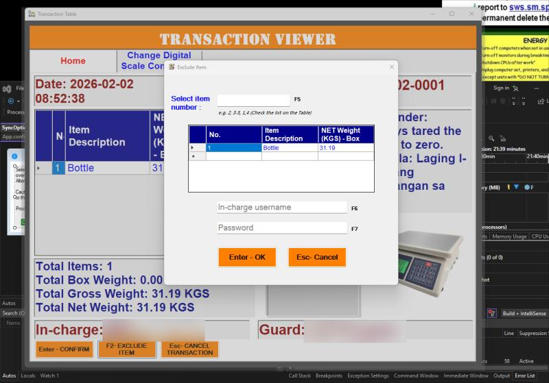

#  Automated Digital Weighing System

The **Automated Digital Weighing System** is a custom Windows application integrated with a digital weighing scale through I/O ports. The system automates scrap weight recording, streamlines data management, and generates structured reports for accounting and administrative departments.

This solution replaces manual paper-based recording with a fully digital workflow, improving operational efficiency, accuracy, and traceability of scrap materials.

> 📝 **Note:** The actual system setup used in the private industrial environment is not publicly shared due to confidentiality. I requested my manager for a version without the full UI design so that it could be included in my portfolio.

---

## 🛑 Problem

In the production environment, scrap materials were previously recorded manually using paper logs.

-  Manual weight recording caused data entry errors  
-  Paper-based tracking slowed down administrative processes  
-  Retrieving historical records was difficult  
-  Data inconsistencies affected accounting and reporting accuracy  

---

## 💡 Solution Implemented

A custom software solution was developed to automate the scrap weighing process.

-  Integrated digital weighing scale with a Windows application  
-  Communication with the weighing device through system I/O ports  
-  Automatic recording of scrap weights into a local database  
-  Structured report generation for accounting and administration  
-  Simple and efficient user interface for operators  

---

## ✅ Results

-  Faster scrap weight recording process  
-  Organized and searchable digital records  
-  Reduced human error in data recording  
-  Improved efficiency for accounting and admin departments  

---

## 🛠️ Tools, Components, and Software Used

### Hardware
- ⚖️ Digital weighing scale  
- 🔌 Industrial I/O port communication interface  

### Software / Development Tools
- 💻 **Windows Desktop Application** (Custom-built)  
- 🧠 **Visual Studio (.NET)** for application development  
- 🗄️ **Local Database** for storing weight records ()

---

## 🗄️ Database

The system uses a **local database** to store scrap weight records and transaction data.

For security and confidentiality reasons, the repository may include only a **sample or template database structure** rather than actual production data.

---

## 🚀 Usage

1. Connect the digital weighing scale to the system.  
2. Launch the Windows weighing application.  
3. Place scrap materials on the scale.  
4. The system automatically reads the weight and records it in the database.  
5. Generate reports for accounting and administrative review.

---

## 🖼️ Screenshots / Interface

.png)

.png)

.png)
